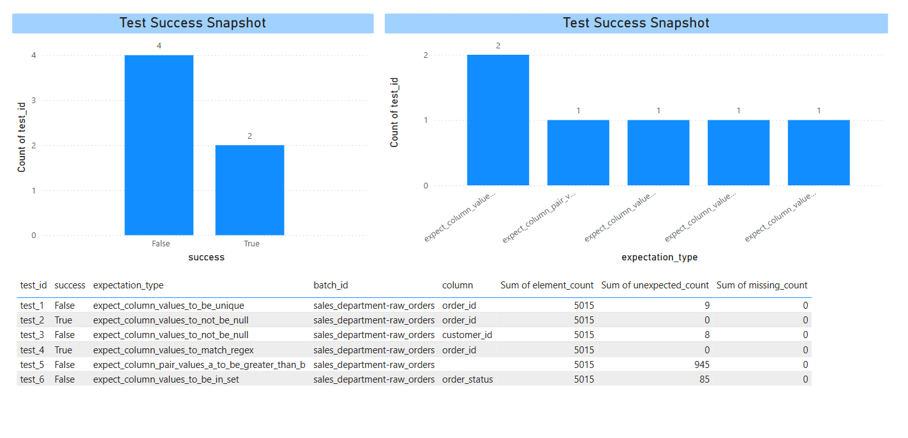

## Great Expectations Framework

- Go through the following [documentation](https://docs.greatexpectations.io/docs/core/introduction/) to get detailed idea on Great Expectations framework.


### **Why Great Expectations? What problems does it solve?**

*   **The Challenge of Data Quality in ETL/ELT:**
    *   We've written pytest tests for transformations, SQL logic, etc. These are great for *code logic*.
    *   But what about the *data itself*? Is the input data what we expect? Is the output data conforming to our business rules and quality standards?
    *   Common issues: Unexpected NULLs, wrong data types, values out of range, format changes in source files, broken relationships between tables.
*   **Great Expectations (GE) helps us to:**
    *   **Declare** what we expect from our data in a clear, human-readable way (these are "Expectations").
    *   **Automatically Validate** data against these expectations.
    *   **Generate comprehensive Data Quality Reports** (Data Docs) that show which expectations passed/failed and for which data.
    *   **Profile Data** to help create expectations.
    *   **Promote Collaboration:** Data Engineers, Analysts, and Business Stakeholders can all understand and contribute to data quality definitions.
*   **Analogy:**
    *   If pytest is like testing the engine of a car (does the engine run? do the parts move correctly?), Great Expectations is like the pre-flight checklist for an airplane pilot AND the post-flight inspection.
        *   **Pre-flight:** "Is the fuel tank full? (e.g., `expect_column_values_to_not_be_null('fuel_level')`)"
        *   **Pre-flight:** "Are all passenger counts within limits? (e.g., `expect_table_row_count_to_be_between(min_value=50, max_value=150)`)"
        *   **Post-flight Inspection:** After running our ETL pipeline, we use GE to check if the output data landed safely and correctly.


### **Core Concepts & Architecture**

*   **Key Components (Illustrate with a simple diagram on a whiteboard/slide):**
    *   **Data Context:** The primary entry point for the GE API. It manages configurations, Datasources, Expectation Suites, and Validation Results. (Think of it as the "Project Manager" for your data quality efforts).
    *   **Datasource:** Connects GE to your data (e.g., files in DBFS, Spark DataFrames, SQL databases). (The "Librarian" that knows where your data books are).
    *   **Expectation:** A verifiable statement about your data. (The "Rule" or "Check" itself, e.g., "column 'user_id' must be unique"). GE has a rich library of built-in expectations.
    *   **Expectation Suite:** A collection of expectations. (A "Checklist" or "Rulebook" for a specific dataset).
    *   **Validator:** Combines a Batch of data (e.g., a DataFrame) with an Expectation Suite to evaluate the expectations against the data. (The "Inspector" who uses the checklist on the data).
    *   **Validation Result:** The output of a validation run, detailing which expectations passed or failed.
    *   **Checkpoint:** A configurable batch job that validates one or more Batches of data against one or more Expectation Suites and takes actions after validation (e.g., saving results, updating Data Docs, sending notifications). (The "Automated QC Process").
    *   **Data Docs:** Human-readable documentation of your expectations, validation results, and data profiles. (The "Quality Report").


```
Data Sources → Expectations → Validation → Results → Actions
     ↓             ↓            ↓          ↓         ↓
   Files,      Quality       Run Tests   Pass/Fail  Alerts,
   APIs,       Rules                               Reports,
   DBs                                            Stop Pipeline
```

### Central Orchestration

```
      ▲
      │
      │
┌─────┴─────────────────────────────────────────────────────────────┐
│                            Data Context                           │
│   - Manages all configurations, suites, datasources, checkpoints │
│   - Central registry for GX objects and state                    │
└──────────────────────────────────────────────────────────────────┘
```

## The Core Misunderstanding

You're thinking: **"I just want to check if my data is good"**

Great Expectations is solving: **"I need to systematically manage data quality across my entire organization, track results over time, automate checks, and enable team collaboration"**


## What Each Layer Actually Does (The Real Purpose)

### **Data Source: "WHO is providing this data?"**

**Purpose**: Identity and accountability

- When validation fails, you need to know WHO to contact
- Different data providers have different SLAs and expectations
- You need to track which systems are reliable vs problematic
- Billing and contracts are often tied to data sources

**Real scenario**:

- Your validation fails on Tuesday
- Without Data Source: "Some data is bad, but where did it come from?"
- With Data Source: "The CRM system data is bad - contact the CRM team"

### **Data Asset: "WHAT stage/type of data is this?"**

**Purpose**: Process tracking and context

- Same data goes through multiple stages (raw → cleaned → aggregated)
- Different stages need different validation rules
- You need to know WHERE in your pipeline things are breaking
- Business teams care about different stages

**Real scenario**:

- Raw data might allow nulls (expected from external systems)
- Cleaned data should have no nulls (your processing should fix this)
- Final reports must have no nulls (business requirement)
- Without Data Asset: "There are nulls somewhere"
- With Data Asset: "Nulls in cleaned data - your processing pipeline is broken"

### **Batch Definition: "WHEN and HOW is this data being validated?"**

**Purpose**: Temporal tracking and automation context

- You need to know if problems are getting worse over time
- Different schedules have different urgency (real-time vs daily)
- Automation systems need to know what type of validation this is
- Historical trending requires consistent identification

**Real scenario**:

- Daily batch fails: "Minor issue, check tomorrow"
- Real-time batch fails: "Critical issue, page the on-call engineer"
- Without Batch Definition: "Some validation failed"
- With Batch Definition: "Real-time customer data validation failed - immediate action needed"

Let's go through the given example where we are validating the sample data:

```python
import great_expectations as gx
import pandas as pd

# Step 1: Get the context
context = gx.get_context()
assert type(context).__name__ == "EphemeralDataContext"

# Step 2: Create a sample dataframe for testing
# (You would replace this with your actual dataframe)
sample_data = {
    'age': [25, 30, 35, 40, 45, 50],
    'name': ['Alice', 'Bob', 'Charlie', 'Diana', 'Eve', 'Frank']
}
dataframe = pd.DataFrame(sample_data)

# Step 3: Create Data Source
data_source_name = "my_data_source"
data_source = context.data_sources.add_pandas(name=data_source_name)

# Step 4: Create Data Asset
data_asset_name = "my_dataframe_data_asset"
data_asset = data_source.add_dataframe_asset(name=data_asset_name)

# Step 5: Create Batch Definition
batch_definition_name = "my_batch_definition"
batch_definition = data_asset.add_batch_definition_whole_dataframe(
    batch_definition_name
)

# Step 6: Create Batch Parameters (provide the actual dataframe)
batch_parameters = {"dataframe": dataframe}

# Step 7: Create an Expectation
# Fixed the min/max values - your original had them reversed
expectation = gx.expectations.ExpectColumnValuesToBeBetween(
    column="age", min_value=18, max_value=100  # Fixed: min should be smaller than max
)

# Step 8: Get the Batch and Validate
batch = batch_definition.get_batch(batch_parameters=batch_parameters)
validation_results = batch.validate(expectation)
print(validation_results)
```

After executing the following script, the given report is generated by the Great Expectations Library.

```json
{
  "success": false,
  "expectation_config": {
    "type": "expect_column_values_to_be_between",
    "kwargs": {
      "batch_id": "my_data_source-my_dataframe_data_asset",
      "column": "age",
      "min_value": 30.0,
      "max_value": 100.0
    },
    "meta": {}
  },
  "result": {
    "element_count": 6,
    "unexpected_count": 1,
    "unexpected_percent": 16.666666666666664,
    "partial_unexpected_list": [
      25
    ],
    "missing_count": 0,
    "missing_percent": 0.0,
    "unexpected_percent_total": 16.666666666666664,
    "unexpected_percent_nonmissing": 16.666666666666664,
    "partial_unexpected_counts": [
      {
        "value": 25,
        "count": 1
      }
    ],
    "partial_unexpected_index_list": [
      0
    ]
  },
  "meta": {},
  "exception_info": {
    "raised_exception": false,
    "exception_traceback": null,
    "exception_message": null
  }
}
```

This Great Expectations report tells you that **a validation check has failed**.

### **Expectation Being Tested**

```json
"type": "expect_column_values_to_be_between",
"kwargs": {
  "column": "age",
  "min_value": 30.0,
  "max_value": 100.0
}
```

You're checking whether all values in the `age` column are between **30 and 100 (inclusive)**.

---

### **Test Input Summary**

```json
"element_count": 6
```

There were **6 non-null values** in the `age` column.

---

### **Validation Result**

```json
"success": false
```

The expectation **failed**. Not all values were within the specified range.

---

### **Failure Details**

```json
"unexpected_count": 1,
"unexpected_percent": 16.67,
"partial_unexpected_list": [25]
```

* **1 value** was outside the range (specifically `25`).
* That’s about **16.67%** of the total values.
* The value `25` occurred **once**.

---

### **Index of Unexpected Values**

```json
"partial_unexpected_index_list": [0]
```

* The value `25` was found at index `0` of your DataFrame.

---

### Exception Info

```json
"raised_exception": false
```

No exceptions were raised — GX handled everything cleanly, but the result still failed logically.

---

### What Should You Do?

If this was intentional (e.g., you expect some data under 30), update the expectation accordingly.

Otherwise:

* Investigate why the `age` value is below 30.
* Decide if this record should be filtered, fixed, or flagged.


## The Fundamental Problem GX Solves

**You're thinking**: Validation = "Is this data good? Yes/No"

**Reality in organizations**: Validation = "Who, what, when, why, how, and what do we do about it?"

## Why Direct Validation Fails at Scale

### **Problem 1: Results Organization**

- You run 100 validations daily
- 3 months later: "Which validations failed most often?"
- Without organization: You have 9,000 individual results with no structure
- With GX structure: "Show me all failures in the CRM system's cleaned data from daily batches"

### **Problem 2: Responsibility Assignment**

- Validation fails
- Without Data Source: "Someone needs to fix something"
- With Data Source: "The vendor integration team needs to fix the CRM connector"

### **Problem 3: Context Understanding**

- Age column has value 150
- Without Data Asset: "Age validation failed"
- With Data Asset: "Age validation failed in raw vendor data (expected, vendor sends bad data) vs age validation failed in final customer reports (critical, our system is broken)"

### **Problem 4: Automation Decisions**

- Validation fails
- Without Batch Definition: "What should the system do?"
- With Batch Definition: "This is a real-time validation - automatically reject the transaction and alert operations"


## Think of it Like Medical Records

**Your approach**: "Just check if patient is healthy"

**Hospital approach**:

- **Patient ID** (Data Source): Which patient/doctor/insurance?
- **Department** (Data Asset): Emergency room vs routine checkup vs surgery?
- **Visit Type** (Batch Definition): Annual physical vs emergency vs follow-up?
- **Results stored with context**: Doctor knows what type of visit, what to compare against, who to notify

## The Real Business Value

### **Without GX Structure:**

- "Data quality check failed"
- Manual investigation needed every time
- No historical context
- Can't automate responses
- Can't assign responsibility
- Can't track trends

### **With GX Structure:**

- "CRM system's real-time customer data failed age validation - Operations team notified, transaction blocked, similar issue happened 3 times this month"
- Automatic routing to correct team
- Historical trending available
- Automated response triggered
- Clear accountability chain

## Why It Seems Unnecessary to You

You're probably working with:

- Small datasets
- One-person projects
- Known data sources
- Immediate analysis

In this context, the structure IS unnecessary overhead.

But imagine you're Netflix, and you have:

- 500 data sources (various content providers, user analytics, billing systems)
- 10,000 datasets
- 50,000 validation rules
- 200 data engineers
- 24/7 operations

Without structure, it's chaos. With structure, it's manageable.

## The Bottom Line

**GX isn't designed for validation**. It's designed for **data quality operations management**.

The Data Source/Asset/Batch Definition hierarchy exists because in real organizations, **the answer to "who do I call when this fails?" is just as important as "did this fail?"**

You're right that for simple validation, it's overkill. But you're asking why a hospital needs medical records when all you want is to check if you have a fever.

---

Perforimg the data validation on realistic data. On orders table. So checking for the following expectations:

```python
no_duplicate_orders = ge.expectations.ExpectColumnValuesToBeUnique(
    column="order_id"
)

no_null_order_id = ge.expectations.ExpectColumnValuesToNotBeNull(
    column="order_id"
)

no_null_customer_id = ge.expectations.ExpectColumnValuesToNotBeNull(
    column="customer_id"
)

order_id_format = ge.expectations.ExpectColumnValuesToMatchRegex(
    column="order_id",
    regex="^[A-Z]{2}-\d{4}-\d{6}$"  # Format: CA-2014-108189
)

date_logic_validation = ge.expectations.ExpectColumnPairValuesAToBeGreaterThanB(
    column_A="order_delivered_customer_date",
    column_B="order_purchase_date",
    or_equal=True,
    ignore_row_if="both_values_are_missing"
)

valid_status = ge.expectations.ExpectColumnValuesToBeInSet(
    column="order_status",
    value_set=["pending", "confirmed", "shipped", "delivered", "cancelled"]
)

report = []
expectations = [
    no_duplicate_orders,
    no_null_order_id,
    no_null_customer_id,
    order_id_format,
    date_logic_validation,
    valid_status]

for expectation in expectations:
    batch = batch_definition.get_batch(batch_parameters=batch_parameters)
    validation_results = batch.validate(expectation)
    report.append(validation_results)
```

Here's the report generated by the **Great Expectations**:

```json
[
  {
    "success": false,
    "expectation_config": {
      "type": "expect_column_values_to_be_unique",
      "kwargs": {
        "batch_id": "sales_department-raw_orders",
        "column": "order_id"
      },
      "meta": {}
    },
    "result": {
      "element_count": 5015,
      "unexpected_count": 9,
      "unexpected_percent": 0.1794616151545364,
      "partial_unexpected_list": [
        "CA-2014-102652",
        "CA-2014-102652",
        "CA-2014-102652",
        "CA-2014-103219",
        "CA-2014-103219",
        "CA-2014-103219",
        "CA-2014-103527",
        "CA-2014-103527",
        "CA-2014-103527"
      ],
      "missing_count": 0,
      "missing_percent": 0.0,
      "unexpected_percent_total": 0.1794616151545364,
      "unexpected_percent_nonmissing": 0.1794616151545364,
      "partial_unexpected_counts": [
        {
          "value": "CA-2014-102652",
          "count": 3
        },
        {
          "value": "CA-2014-103219",
          "count": 3
        },
        {
          "value": "CA-2014-103527",
          "count": 3
        }
      ]
    },
    "meta": {},
    "exception_info": {
      "raised_exception": false,
      "exception_traceback": null,
      "exception_message": null
    }
  },
  {...},
  {...},
]
```

The given report is then visualized in Power BI:


You can also refer [this](https://app.powerbi.com/view?r=eyJrIjoiYjEyMzFkOGYtODJjNi00NTIyLTg2MjktY2ViOGQ5YjNmM2Y3IiwidCI6IjY1YzRiOGJiLWExZWYtNDY5Mi04NjQwLWEzMTVkN2NhMWE1MyJ9) link to view the dashboard.


